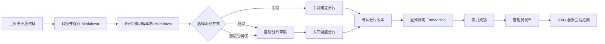

# RAG 知识库第一版执行方案（调整稿）

更新时间：2026-08-04

状态：阶段一、二已提交至 Draft PR；阶段三、四已在功能分支完成实现与自动化真实链路验证；阶段五的受控后端联调已通过，待前端人工验收。旧版 QuickBar 内嵌制度面板不进入人工验收，已由本文件定义的“RAG 悬浮会话 + Markdown 审核切分”方案替换。

## 1. 本次方案结论

第一版只启用“公司制度问答”，但将后台定位为通用的 **RAG 知识库**：资料类型、导入接口、检索接口和前端配置从一开始就预置公司历史、近期动态、FAQ、部门知识。后续启用新资料类型时，不需要改动主接口契约、悬浮会话骨架或切分流程。

用户端的 RAG 入口改为可隐藏、可展开、可拖动的悬浮小球。展开后是一个独立于普通聊天视觉时间线的小型 RAG 会话窗口，包含常用制度功能卡片、文字或语音提问、流式答案和引用。普通聊天与 RAG 会话是两个界面窗口，但仍由同一个用户会话与记忆编排体系托管。

RAG 悬浮小球同时是一个由后台控制的用户功能：在现有 `users` 表增加 `rag_enabled`，第一版默认关闭。管理员在用户管理中为指定用户启用后，用户端才加载入口和会话窗口；查询接口也校验该开关，不能通过直接调用接口绕过。

管理员先在“RAG 知识库”上传电子版资料，系统将其转换并保存为 Markdown 正文；随后在“切分细则”中选择自动切分、手动切分，或自动切分后人工调优。只有已确认的 Markdown 分片才能调用 Embedding 模型向量化，向量化成功后才可发布。回答必须附带资料名称、章节、版本和生效信息；找不到依据时必须明确说明，不得编造资料内容。

现有 PostgreSQL 已安装 pgvector，项目也已具备 1536 维 Embedding、HNSW 索引和聊天模型网关。第一版继续使用这些能力，不新增独立向量数据库、不训练模型、不引入消息队列。

## 2. 对“统一记忆管理”的修正

此前“制度问答不写普通聊天记录或个人记忆，和个人记忆完全隔离”的表述不准确。本方案采用以下原则：**统一管理、按作用域隔离、按来源检索。**

### 2.1 统一的部分

- RAG 问答与普通聊天一样，保存到当前用户的 `sessions / messages`；用户重新打开悬浮会话时能回看该会话的 RAG 问答。
- 问答消息进入现有会话摘要和统一记忆治理流程，不再成为界面外的一次性结果。
- 用户通过同一个“记忆与知识”心智模型使用伴行：个人事实、当前会话、公司知识都是可被编排的上下文来源。
- 管理端统一管理资料的创建、更新、发布、失效、检索状态和审计记录。

### 2.2 仍必须隔离的部分

- 公司制度原文、制度分片和向量索引属于公司作用域，不能被复制为每位用户的个人记忆，也不能作为用户画像或偏好写入 `memory_items`。
- 个人记忆仍按现有 `memory_items.user_id` 归属，且不能参与公司制度的证据检索。
- 公司制度问答只从已发布、已生效的公司资料中得出结论；个人记忆可用于理解语气或当前上下文，但不能作为制度依据。
- 用户删除个人记忆或聊天记录，不会删除公司制度；管理员下架制度后，后续制度检索不能再命中它。

这里的“统一”是统一入口、统一生命周期、统一会话记录和统一上下文编排，**不是把所有数据硬塞进同一张表**。当前 `memory_items` 的 `user_id` 为必填，且服务、索引、冲突处理都按用户记忆设计；直接把全公司制度写进去会造成越权、重复、画像污染和错误的失效语义。

### 2.3 第一版的具体落地

- RAG 悬浮会话的提问和答案均写入当前 `messages`；新增 `msg_type=company_knowledge`，并在 `metadata_` 中保存检索来源、资料版本、回答模式、检索状态及 `ui_channel=rag_floating_chat`。
- 普通聊天时间线默认过滤 `ui_channel=rag_floating_chat`，悬浮会话只加载这个通道的消息。这样形成两个独立聊天窗口，同时不新建第二套会话、鉴权或记忆编排体系。
- 制度问答完成后，仍触发现有会话摘要刷新。摘要可记录“本会话询问过某制度”，但不把整段制度文本沉淀为默契画像或共建记忆。
- 只有用户明确表达、且符合现有记忆提取规则的个人事实，才由原有记忆流程写入个人记忆。例如“我下周要申请婚假”可以成为用户自己的短期事项；“婚假制度是 15 天”只能保留为公司资料引用，不能成为个人偏好或画像。
- 第一版不在用户端“记忆管理”页面展示公司知识入口；只统一会话记录和记忆编排，不重构现有个人记忆表。

## 3. 目标、范围与非目标

### 3.1 目标

- 为登录用户提供基于已发布公司制度的可信问答。
- 每个答案可追溯到制度名称、章节、版本和生效日期。
- 管理员无需手工写数据库即可上传、发布、替换和下架制度。
- 使用电子版测试资料自动验证导入、索引、检索、会话保存和引用展示全链路。

### 3.2 第一版范围

- 首批启用资料：公司制度。
- 预置资料类型：`policy`（公司制度，第一版启用）、`faq`（常见问答）、`history`（公司历史）、`news`（近期动态）、`department_knowledge`（部门知识）。后四类第一版仅完成前后端契约和配置注册，不允许导入或面向用户查询。
- 支持格式：第一版先覆盖 UTF-8 编码的 `.txt` 与 `.md`；所有可成功导入的资料都转换为标准 Markdown，Markdown 是后续预览、切分、审计与重建索引的唯一正文来源。Word、PDF、扫描件和 OCR 以转换适配器方式后续接入，不能绕过 Markdown 与切分确认流程直接向量化。
- 用户角色：普通用户、管理员；不区分部门、岗位或资料密级。RAG 功能采用按用户白名单启用，默认关闭；账户被禁用时，无论是否已启用 RAG 都不能使用。
- 用户入口：聊天页右下角的可隐藏 RAG 悬浮小球及独立悬浮会话窗口。
- 管理入口：复用 `frontend-admin`；将“公司制度”更名为“RAG 知识库”，另增加“切分细则”入口。
- 输入方式：文字输入和语音输入；语音识别完成后进入同一制度问答链路。
- 资料状态：`markdown_ready`、`chunking`、`chunk_ready`、`indexing`、`indexed`（待检索验证）、`validated`（待发布）、`published`、`failed`、`archived`。
- 检索方式：已发布且生效资料的向量检索，返回引用；无结果时明确拒绝猜测。

### 3.3 延后内容

- PDF、Word、扫描件、图片和 OCR 的实际转换适配器。
- 部门、岗位、密级等细粒度资料权限。
- 公司历史、近期动态、业务 FAQ、部门知识的实际资料导入、用户入口与业务规则；相关接口和前端配置已在第一版预置。
- 在线编辑原始二进制文件、多人审批流、复杂运营分析。
- 独立向量数据库、检索重排模型、关键词/向量混合检索。
- 任意普通聊天自动识别并改走 RAG；第一版只由“公司制度”入口发起检索。
- 制度问答计费；内部测试验证完成后再作为单独的计费项接入现有计费体系。

## 4. 用户体验方案

### 4.1 聊天页

RAG 不再占用 QuickBar，也不嵌入普通聊天流。采用独立的悬浮会话：

1. 默认在聊天页右下角展示一个带知识库标识的悬浮小球；桌面端可拖动位置，位置与展开状态仅保存在本地浏览器。
   - 用户端先从后端取得 RAG 功能权限；未启用用户不挂载小球、贴边把手或 RAG 窗口，也不保留可恢复的本地悬浮状态。
2. 小球可展开为小型 RAG 会话窗口，也可收起；用户选择“隐藏”时保留贴边的小把手，确保不会出现无法重新打开入口的死状态。
3. 展开窗口具有拖拽手柄、收起、隐藏、关闭和尺寸切换控件；桌面端是可移动的浮窗，移动端改为贴近安全区的固定底部会话层，不要求拖动。
4. 窗口内部按“缩小版聊天”组织：顶部为当前知识范围与窗口控件，中部为该 RAG 通道的消息列表和引用，底部为文字、麦克风和发送控件。
5. 空会话先展示常用功能卡片，而不是一整屏说明文字。第一版卡片为“请假与考勤”“费用报销”“出差与差旅”“办公与信息安全”；点击仅填入相应问题或范围，不伪造答案。资料类型启用后，可由同一份类型配置增加“公司动态”“常见问答”等卡片。
6. 用户可键盘输入，或点击麦克风进行语音输入；语音识别出的文字先回填输入框，允许确认或编辑后再提交。制度答案仅以文字展示，不触发语音播放。
7. 回答在窗口内流式呈现；来源默认收起为“参考来源”入口，用户展开后才显示资料名称、章节、版本和生效日期，并可继续点击“片段”查看当次命中的 Markdown 原文片段。
8. 同一个 `session_id` 下的 RAG 消息只在悬浮窗口回放，普通聊天时间线不混排；关闭窗口不丢失问答，重新展开可继续该 RAG 通道。

管理员关闭用户的 RAG 权限后，用户下一次进入聊天页、重新展开窗口或发送新问题时立即失去入口与访问权限；既有问答记录为审计而保留在数据库，但不会通过 RAG 通道返回给未启用用户。

这满足“两个聊天窗口”的使用感，同时保持一个用户会话、鉴权、摘要和记忆编排边界，不引入第二套聊天数据模型。

### 4.2 空结果与异常状态

- 无证据：提示“当前已发布制度中未找到可引用依据”，并建议用户联系制度管理员。
- 制度已失效：不参与回答；若只有失效资料匹配，仍按无证据处理。
- 索引处理中：普通用户不检索该资料，管理员可在后台看到状态。
- 模型失败：提示“暂时无法生成制度答复”，不返回未验证的通用回答。
- 网络中断：保留用户已输入的问题，允许再次提交。
- 麦克风权限被拒绝、录音取消或识别失败：清晰提示原因，保留文字输入作为可用替代方式。

## 5. 管理后台方案

现有管理端位于 `frontend-admin`，已具备登录、侧栏、路由、管理员 token 和管理接口约定。第一版不另起后台项目：将侧栏“公司制度”更名为“RAG 知识库”，并新增同级入口“切分细则”。前者只管理资料及其 Markdown 正文，后者管理资料在向量化前的分片确认。

### 5.1 管理员可做的事

- **RAG 知识库：** 查看资料列表，包括资料名称、类型、版本、生效日期、Markdown 状态、分片状态、索引状态、上传人、更新时间、分片数量和失败原因。
- **RAG 知识库：** 上传 `.txt` 或 `.md` 文件，填写资料名称、版本、生效日期和可选分类；服务完成格式校验和 Markdown 转换后，停在 `markdown_ready`，不自动切分或向量化。
- **RAG 知识库：** 打开 Markdown 预览，检查标题、正文、表格文本和转换告警；空文件、重复内容、转换失败或同名同版本资料必须阻止进入切分。
- **切分细则：** 管理一份或多份可复用的自动切分规则，例如按 Markdown 标题优先、目标字符数、最小/最大长度、重叠长度和表格不拆分策略；规则变更不会隐式改写已发布资料。
- **切分细则：** 对某一份 Markdown 选择三种模式：`自动切分`、`手动切分`、`自动切分后人工调优`。手动模式可新增、删除、合并、拆分、排序分片，编辑分片正文和章节路径，并在预览中看到分片边界。
- **切分细则：** 管理员确认分片后生成不可变的“待索引分片版本”；未确认的草稿分片绝不进入向量表。
- **索引、检索验证与发布：** 管理员显式点击“向量化”，系统只为已确认分片调用 Embedding；全部成功后进入 `indexed`。管理员必须以典型问题验证当前分片集的 Top-K 命中、相似度和预期章节，再确认进入 `validated`，一名管理员才能发布。发布与下架仍沿用当前规则；下架后立即不再参与检索。
- **版本替换与重建：** 未下架资料以“资料名称 + 版本号”保持唯一；已下架资料仅作为历史记录，不占用同名同版本的重新上传。新版本发布时下架旧版本；如果 Markdown、分片或 Embedding 模型变更，创建新的分片/索引版本，完成后原子切换，不覆盖既有审计记录。
- **资料管理：** 未发布且未在索引中的资料可编辑名称、版本、分类和生效/失效日期，不改写原文件、Markdown、分片或历史引用。仅已下架资料可物理删除；已发布资料必须上传新版本替换。
- **任务与审计：** 查看 Markdown 转换、自动切分、向量化、重建任务的开始时间、结束时间、成功数、失败信息、所选切分模式和操作管理员，并可对失败步骤重试。
- **用户管理：** 在现有用户列表增加“RAG 知识库”启用开关、已启用筛选和批量启用/关闭。第一版默认关闭，只允许后台管理员为明确选定的有效用户开启；操作记录管理员和更新时间。

### 5.2 权限处理

- 用户端接口使用现有用户 JWT，所有已登录普通用户可以查询已发布制度。
- 管理端接口复用现有管理员 JWT 和 `get_current_admin` 鉴权。
- 当前后台已有 `admin` 与 `super` 两种内部角色；第一版的制度管理权限对两者都开放，产品层面仍只呈现“普通用户 / 管理员”两类角色。任何后台管理员都可以承担资料上传、更新和发布职责，不额外指定资料负责人或更新负责人。
- 第一版不增加部门字段、不做资料范围过滤；数据库模型预留 `access_scope` 元数据，默认值为 `all_users`。
- RAG 用户功能权限与资料 `access_scope` 分开判断。只有账户状态为 `active`、用户 RAG 开关为启用、且资料类型已启用时，用户才能看到入口、读取 RAG 消息或执行检索；任何一项不满足均返回明确的无权限结果。

## 6. 后端架构与接口

### 6.1 模块边界

新增独立模块 `backend/app/plugins/company_knowledge/`，避免把资料导入、文本切分、向量化和回答提示词散落到聊天接口。

建议结构：

```text
backend/app/plugins/company_knowledge/
  models.py        # 知识资料、Markdown 正文、分片版本、索引任务模型
  schemas.py       # 用户端与管理端请求、响应模型
  importer.py      # TXT/Markdown 读取、转换、规范化、校验
  markdown_service.py # Markdown 正文存储、预览与版本校验
  chunker.py       # 自动切分规则、分片草稿与手工调整
  indexing_service.py # 已确认分片的 Embedding、重建与原子切换
  service.py       # 资料状态、发布、下架、版本替换
  retriever.py     # 生效资料过滤、向量检索、引用构建
  answer_service.py# 提示词组装、流式生成、RAG 通道消息写入
  prompts.py       # 制度回答约束
```

路由按调用方分开，服务层共享：

```text
/api/company-knowledge/query              # 登录用户：制度提问（SSE）
/api/company-knowledge/types              # 登录用户：查询已注册资料类型及当前可用状态
/api/admin/company-knowledge/sources      # 管理员：资料列表、上传、Markdown 详情
/api/admin/company-knowledge/sources/{id}/markdown # 管理员：读取 Markdown 正文与转换告警
/api/admin/company-knowledge/chunking-rules # 管理员：切分规则的列表、创建、修改
/api/admin/company-knowledge/sources/{id}/chunks # 管理员：生成、编辑、确认分片
/api/admin/company-knowledge/sources/{id}/index  # 管理员：对已确认分片向量化或重建
/api/admin/company-knowledge/sources/{id}/chunk-sets/{set_id}/retrieval-preview # 管理员：发布前检索验证
/api/admin/company-knowledge/sources/{id}/chunk-sets/{set_id}/validate # 管理员：确认检索验证
/api/admin/company-knowledge/sources/{id} # 管理员：发布、下架、版本替换
/api/admin/company-knowledge/jobs         # 管理员：转换、切分、索引任务与重试
/api/admin/users/{id}/rag-enabled         # 管理员：启用或关闭单个用户 RAG
```

资料类型使用统一注册表，而不是把 `policy / faq / history / news / department_knowledge` 分散写入各个路由条件中。每类至少配置显示名称、描述、是否允许导入、是否允许检索、是否在用户端展示、所需元数据和预留图标。第一版只有 `policy` 的“允许导入、允许检索、用户端展示”均为真；其余类型由 `/types` 接口返回为已注册但未启用。

前端根据同一份类型配置组织 RAG 悬浮窗口的范围选择和常用功能卡片：当前只允许 `policy` 检索，不展示不可用的空卡片；当后续开启 FAQ、历史、近期动态或部门知识时，只需更新配置和对应资料，不必改变悬浮会话、消息保存、来源引用或接口调用方式。

### 6.2 与现有聊天和记忆的接入

制度问答接口接受当前 `session_id`、RAG 窗口通道标识和已识别的文本问题。后端先判断当前用户的 `users.rag_enabled` 是否为真，未启用直接返回 `403`，不创建会话、不写入消息、不执行向量检索。如果没有普通会话，则按当前聊天规则创建会话；随后按以下顺序处理：

1. 保存用户问题为 `messages.role=user`、`msg_type=company_knowledge`，并写入 `metadata_.ui_channel=rag_floating_chat`。
2. 仅在公司制度作用域内检索证据。
3. 以证据和回答约束调用现有模型网关。
4. 保存答案为 `messages.role=agent`、`msg_type=company_knowledge`，保持相同的 RAG 窗口通道。
5. 在答案消息的 `metadata_` 中保存来源快照，包括资料 ID、Markdown/分片版本、名称、资料版本、章节、分片 ID、片段摘要和检索时间。
6. 调用现有会话摘要刷新；个人记忆提取必须识别 `company_knowledge` 模式，避免将制度正文误写为用户画像或共建事实。

普通聊天加载消息时过滤该 RAG 通道，RAG 悬浮窗口只读取该通道；RAG 通道消息读取接口同样校验用户开关。这使两个窗口各自连贯，又让聊天记录和记忆治理统一。回答依据在资料更新或下架后仍可审计。

语音输入不新增一套 RAG 接口或语音知识模型。前端复用项目现有的录音/语音识别能力，将识别文本交给同一个制度问答接口。第一版仅要求“语音输入，文字回答”；是否将制度答案再合成为语音，留待后续单独设计。开始实现前需确认最新 `upstream/main` 是否已包含语音能力；若尚未合入，则以已合并的语音实现为基础接入，避免在 RAG 分支复制一套录音逻辑。

### 6.3 回答约束

回答提示词必须包含以下规则：

- 只依据本次传入的已发布、已索引 Markdown 分片回答。
- 信息不足、引用互相矛盾或制度未覆盖时，直接说明没有足够依据。
- 不把模型常识、个人记忆、旧会话猜测写成公司规则。
- 对有时效性的内容优先引用当前生效版本。
- 每个结论都对应至少一个来源；输出结构包含正文和来源列表。

## 7. 数据库与索引设计

不复用当前 `memory_items` 存放资料正文。公司知识模块使用资料、分片版本、分片和任务四类数据，同时与统一聊天/记忆编排对接。

### 7.1 `company_knowledge_sources`

一行代表一份资料的一个业务版本，也是 RAG 知识库中的 Markdown 正文载体。

关键字段：

- `id`、`title`、`knowledge_type`、`category`。`knowledge_type` 使用预置资料类型；第一版实际写入仅允许 `policy`。同一资料名称与版本号组合唯一。
- `source_format`、`file_name`、`markdown_content`、`markdown_hash`、`markdown_version`、`conversion_warnings`。原始电子文件只用于转换；Markdown 是业务正文、预览、切分和重建索引的唯一依据。
- `version`、`effective_at`、`expires_at`。
- `status`：`markdown_ready / chunking / chunk_ready / indexing / indexed / published / failed / archived`。
- `access_scope`：第一版固定为 `all_users`；后续部门知识可扩展为部门范围，但本次不启用部门过滤。
- `created_by`、`published_by`、`created_at`、`updated_at`、`published_at`。
- `replaced_source_id`：指向被新版替换的旧资料。

对 `title + version` 建立唯一索引；文件名和制度编号若存在，仅作为检索和审计辅助字段，不能替代版本唯一性判断。

第一版不需要对象存储。TXT 会被规范为 Markdown 段落和标题层级；Markdown 上传则规范化后保存。后续 Word/PDF 转换适配器也只能写入 `markdown_content`，不应直接操作分片或向量。

### 7.2 `company_knowledge_chunk_sets`

一行代表某份 Markdown 正文的一次可审核分片版本，解决“预览/人工调整”与“已经参与检索的向量”不能混在一起的问题。

关键字段：

- `id`、`source_id`、`markdown_version`、`mode`（`auto / manual / auto_then_manual`）、`status`（`draft / confirmed / indexing / indexed / superseded / failed`）。
- `rule_snapshot`：自动切分时使用的规则和参数快照；纯手动模式为空。
- `created_by`、`confirmed_by`、`created_at`、`confirmed_at`、`superseded_at`。
- `total_chunks`、`indexed_chunks`、`error_message`。

一个资料在任一时刻最多只有一个 `indexed` 且可发布的分片版本。调整切分不覆盖历史版本：新建草稿分片版本，确认并索引成功后再替换活动版本。

### 7.3 `company_knowledge_chunks`

一行代表一段可检索资料内容。

关键字段：

- `id`、`source_id`、`chunk_set_id`、`chunk_index`、`section_path`、`content`、`content_hash`。
- `token_count`、可空的 `embedding vector(1536)`、`metadata`、`status`。草稿/未确认分片没有向量；只有已确认分片在显式索引后写入向量。
- `created_at`、`updated_at`。

索引：

- `chunk_set_id + chunk_index` 唯一索引，保证同一分片版本的顺序稳定。
- `embedding` 使用 `vector_cosine_ops` 的 HNSW 索引。
- `source_id`、`chunk_set_id`、`status` 普通索引，便于版本替换、审核与下架处理。

### 7.4 `company_knowledge_jobs`

记录导入和重建过程，避免管理员只能通过日志判断结果。

关键字段：

- `id`、`source_id`、`chunk_set_id`、`job_type`（`convert / auto_chunk / index / reindex`）、`status`。
- `requested_by`、`started_at`、`finished_at`。
- `total_chunks`、`succeeded_chunks`、`failed_chunks`、`error_message`、`request_snapshot`。

### 7.5 迁移方式

- 按项目现有 `backend/app/db/session.py` 的迁移列表模式新增幂等 DDL，并同步增加 SQLAlchemy 模型。
- 已有 `raw_content` 资料需一次性规范为 `markdown_content`；现有自动生成的向量分片标记为历史分片版本，不能与新的人工审核分片混用。
- 迁移不改写任何已有个人记忆、聊天记录或真实用户资料。当前已下架的 `RAG-TEST / 非正式测试文件` 继续保持下架，不自动重新发布或参与回归。
- 先使用匿名化测试制度验证 Markdown 转换、分片版本和索引切换；任何真实制度导入前，单独征得明确许可。

### 7.6 用户 RAG 开关

在现有 `users` 表增加 `rag_enabled BOOLEAN DEFAULT FALSE`。管理员在用户管理页修改该字段；用户端读取该值决定是否展示小球，RAG 查询接口也直接检查该值。账户 `status=disabled` 时仍禁止访问。

## 8. 导入、切分与检索流程

### 8.1 导入流程



1. 管理员在 **RAG 知识库** 上传 UTF-8 的 TXT 或 Markdown 资料，并填写资料名称、版本和生效日期。
2. 服务根据 `knowledge_type` 校验是否已启用导入；第一版仅接受 `policy`，其余预置类型返回明确的“暂未启用”结果。
3. 服务执行格式和内容校验、内容哈希去重，将资料转换/规范化为 `markdown_content`；未下架资料中相同名称和版本号不能重复创建，已下架历史资料不占用该组合。
4. 转换成功后资料状态为 `markdown_ready`。管理员在知识库预览 Markdown 与转换告警；第一版正文不做在线改写，修正内容通过上传新版本完成。
5. 管理员进入 **切分细则**，为该 Markdown 选择模式：
   - `自动切分`：用所选规则按标题、段落和长度生成分片草稿；
   - `手动切分`：管理员从 Markdown 标题/段落边界创建、合并、拆分和排序分片；
   - `自动切分后人工调优`：先生成草稿，再对分片正文、章节路径和边界逐项调整。
6. 管理员预览所有分片、确认没有空片段、超长片段、缺失章节路径或错误切断后，显式确认该分片版本，资料状态转为 `chunk_ready`。
7. 管理员点击“向量化”后，服务才复用 `text-embedding-v4` 为该已确认分片版本生成 1536 维向量，并记录索引任务；全部成功后资料状态为 `indexed`，尚不可发布。
8. 管理员在 **切分细则** 的“检索验证”中输入典型问题，只检索当前已索引分片版本，查看 Top-K 结果、相似度、最低阈值通过情况和命中的分片正文。管理员可选择预期分片，系统据此显示该问题是否在 Top-K 命中；未命中时应返回切分或向量化步骤调整后重新验证。
9. 管理员确认检索验证时，服务会再次执行该问题的向量检索，要求至少一条结果达到最低相似度；若已选择预期分片，还必须在 Top-K 命中。通过后分片集状态转为 `validated`，资料进入待发布状态。任一后台管理员可直接发布；发布时只激活当前已验证分片版本，旧版本按版本替换规则下架。

第一版为小体积电子资料保留同步执行能力，但每个转换、自动切分和索引步骤必须落任务记录与状态。资料规模或耗时增长后，将同一状态机迁移到可靠的后台任务队列，不改变管理员流程。

### 8.2 检索和回答流程

1. 验证用户登录、账户状态、当前会话归属及 `users.rag_enabled` 用户功能权限；未启用直接拒绝。
2. 校验请求的 `knowledge_type` 是否允许检索；第一版只允许 `policy`。
3. 只选择 `published`、已到生效日、未过期、`access_scope=all_users` 且属于当前 `indexed` 分片版本的对应资料类型分片。
4. 用现有 Embedding 服务向量化问题，通过 pgvector 余弦距离获取候选片段。
5. 按相似度阈值、来源有效性和版本规则筛除弱证据；没有可靠片段时返回无证据结果，不调用聊天模型编造答案。
6. 将候选片段、标题、章节、版本和生效日期组装为受限上下文，调用现有聊天模型网关流式生成。
7. 返回正文和来源，并将同一份来源快照写入会话消息元数据。

第一版不添加 reranker。先依据电子版制度测试集评估命中率、引用准确率和无答案表现；若语义召回不够稳定，再评估重排模型或混合检索。

## 9. 模型、基础设施与数据准备

### 9.1 模型

- Markdown 转换：第一版 TXT/Markdown 通过确定性的解析与规范化完成，不用生成模型改写原文；后续文件格式由独立转换适配器输出 Markdown 与转换告警。
- Embedding：复用现有阿里云百炼兼容调用和 `text-embedding-v4`，维度固定为 1536，仅处理已确认的分片版本。
- 生成：复用现有 `model_gateway` 配置的聊天模型。
- 第一版不需要微调模型、独立重排模型或额外的向量模型。

开发前需确认 `.env` 中的 Embedding API Key、工作空间和聊天模型均可用，但不得在日志、文档或提交中记录密钥。

### 9.2 数据库与向量数据库决策

当前 PostgreSQL 使用 `pgvector/pgvector:pg16`，已经适合第一版制度资料的存储和检索：

- 数据和业务事务在同一个数据库，资料发布、版本替换和索引状态容易保持一致。
- 现有向量维度、依赖和 HNSW 实践可复用。
- 首批制度数量和并发都不需要独立向量数据库。

当资料片段达到数十万级、检索延迟持续超出产品目标，或需要复杂多租户/混合检索能力时，再基于实际指标评估独立向量数据库。

### 9.3 测试资料

测试不手工插入数据库。准备匿名化、电子版的 TXT/Markdown 文件，通过实际管理端上传或管理接口进入系统。

建议至少准备：

- 5 至 8 份小型制度文件，例如考勤休假、报销、差旅、信息安全、办公规范。
- 每份包含明确标题、章节、版本和生效日期；其中至少一份准备旧版与新版。
- 30 条左右自动化问答用例：直接问法、同义改写、跨章节、无答案、过期版本、重复上传、下架后不可命中、引用可追溯。
- 至少 10 组切分验证：自动切分边界、纯手动合并/拆分、自动后人工调整、未确认分片不能索引、编辑 Markdown 后旧分片失效、索引版本原子切换。
- 悬浮会话测试覆盖展开、收起、隐藏后恢复、桌面拖动、移动端安全区、与普通聊天时间线隔离、重新打开后的 RAG 消息回放，以及语音转写后可编辑提交。
- 用户功能权限测试覆盖默认关闭、单用户启用/关闭、批量操作、账户禁用优先、前端不展示入口、直接调用查询接口返回 `403`，以及关闭后 RAG 历史不再通过该通道读取。
- 单元测试使用固定/模拟向量和模型输出，保证可重复；联调环境再使用真实 Embedding 与聊天模型验证端到端效果。

真实公司制度允许导入本地或开发环境，用于测试和联调；但不得进入 Git 仓库、测试夹具、日志或前端静态资源。自动化测试仍使用可公开、可重复的电子版测试资料，避免测试结果依赖真实制度内容。

## 10. 分阶段实施与验收

### 阶段一：契约、数据模型和统一会话接入（已完成）

实施内容：

- 从最新 `upstream/main` 新建独立功能分支。
- 建立公司知识模块、模型、迁移、请求响应模型和空实现测试。
- 建立资料类型注册表、`/types` 契约和前端类型配置；注册五类资料类型，但仅启用 `policy`。
- 扩展消息类型和元数据约定，使制度问答能写入当前会话。
- 增加个人记忆提取的来源过滤规则，避免制度正文污染个人记忆。
- 建立匿名测试资料目录和自动化测试基架。

验收：

- 数据库迁移可重复执行。
- 用户会话、个人记忆、公司制度表之间的归属和权限边界有测试覆盖。
- 使用电子版测试资料验证迁移和导入契约；真实制度可在受控的本地或开发环境中导入联调，但不写入测试夹具或版本库。

本次实现记录：

- 新增公司知识模块、三张数据表模型和幂等迁移定义；未执行迁移，也未写入真实数据库。
- 注册五种资料类型，并提供用户端与管理端的类型查询接口和前端配置；当前只有 `policy` 可用。
- 固化文字/语音提问请求契约；实际导入、检索和回答仍在阶段二实现。
- 公司知识消息会保留在会话中，但人物画像摘要会排除它们。
- 已通过后端编译、6 条公司知识契约测试、既有语音回归测试以及用户端和管理端生产构建。

### 阶段二：自动化闭环基线（已完成，作为后续重构基础）

实施内容：

- 在现有后台新增资料页面和管理接口；页面与接口按统一资料类型契约实现，但第一版只允许操作 `policy`。
- 完成 TXT/Markdown 导入、规范化、自动切分、去重、向量化、发布、下架、版本替换和任务记录的最小闭环。
- 完成公司制度提问接口、来源约束、流式回答、来源快照和消息保存。
- 使用电子版测试制度完成端到端自动化验证。

验收：

- 已发布新版能命中，旧版或下架资料不能再作为新回答依据。
- 每个有答案的测试用例都返回正确来源；无答案不编造。
- 问答内容可在同一聊天会话中回看，且不产生错误的个人画像或共建记忆。

本次实现记录：

- 新增 UTF-8 TXT/Markdown 导入、章节切分、批量向量化、草稿发布、下架、同名制度版本替换、重建索引和任务记录服务。
- 新增管理员资料列表、上传、详情预览、发布、下架、重建与任务查询接口，并在现有 `frontend-admin` 加入资料页面。
- 用户端制度问答已改为 SSE：仅检索已发布且已生效的 `policy` 分片，返回来源快照；无证据或检索失败时不回退到普通聊天模型。
- 制度问题和回答以 `company_knowledge` 消息类型写入当前会话，来源快照保存到答案元数据；画像提取继续过滤该消息类型。
- 已添加 6 份匿名电子版制度夹具（含同名 V1/V2 版本）和本地替身端到端测试。
- 已在获得授权后完成一次真实本地联调：本地后端启动时执行了现有的幂等迁移；用户提供的 TXT 仅以 `RAG-TEST / 非正式测试文件` 标识导入，完成索引、发布、普通用户 SSE 问答和会话来源快照回查后立即下架；该文件未复制到仓库、测试夹具、日志或前端静态资源。

本阶段的“上传后自动切分并直接向量化”不再作为正式产品流程。后续阶段会保留其导入、检索、版本和来源审计能力，并改造成 Markdown 审核与人工可控切分。

### 阶段三：RAG 知识库与审核切分（已完成，待人工验收）

实施内容：

- 在 `users` 增加默认关闭的 `rag_enabled`，用户管理提供逐用户开关；未启用用户不能查询 RAG。
- 将后台“公司制度”重命名为“RAG 知识库”，页面只负责上传、资料列表、Markdown 转换结果、Markdown 预览、版本及发布状态。
- 新增“切分细则”页面、自动切分规则、手动切分编辑器、自动后人工调优、分片版本确认和索引任务视图。
- 改造数据模型与接口：Markdown 正文、分片版本、草稿分片和已索引分片分离；未确认分片不能调用 Embedding。
- 让发布仅依赖当前已索引的分片版本，保证切分重做或模型切换不会破坏线上引用与历史审计。

验收：

- 导入一份资料后只能得到可审阅 Markdown，不能直接产生向量。
- 默认用户不能获取 RAG 入口或调用 RAG 查询；管理员启用指定用户后，入口、通道消息读取和查询接口同时生效。
- 三种切分模式均可生成、预览并确认稳定的分片顺序和章节路径；手动调整会创建新分片版本。
- 未确认或向量化失败的分片绝不参与查询；已发布资料的旧引用在重新切分后仍可回放。
- 后端迁移、资料状态机、转换/切分/索引服务和管理端构建均有自动测试覆盖。

### 阶段四：RAG 悬浮会话（已完成，待人工验收）

实施内容：

- 移除 QuickBar 内嵌制度面板，将入口替换为可隐藏、可展开、桌面可拖动的 RAG 悬浮小球。
- 实现独立小型 RAG 会话窗口、常用功能卡片、流式答案、来源片段、文本输入和语音转写后编辑提交。
- 在同一 `session_id` 下通过 `ui_channel=rag_floating_chat` 让 RAG 与普通聊天拥有独立时间线；保持同一鉴权、会话摘要和个人记忆污染过滤。
- 仅在后端返回用户 RAG 权限已启用时挂载悬浮入口；权限变化后以服务端结果收起窗口并阻止继续读取或提问。
- 完成桌面和移动端布局、窗口状态本地恢复；视觉与交互由阶段五人工验收最终确认。

验收：

- 小球的展开、收起、隐藏后恢复、拖动位置和移动端安全区均正常，入口不会被遮挡或隐藏到无法恢复。
- 常用功能卡片、文字提问、语音转写编辑、流式回复、来源展开、无证据和网络失败状态完整可用。
- RAG 消息不会混入普通聊天时间线；关闭并重新打开 RAG 窗口可正确回放 RAG 消息、答案和当次来源快照。
- 前端生产构建与后端测试通过；桌面/移动端的视觉、拖动和交互由阶段五人工验收最终确认。

### 阶段五：受控联调与人工验收（受控联调已通过，待前端人工验收）

- 已完成匿名电子版夹具的全链路自动化回归。
- 经授权，以 `RAG-TEST / 非正式测试文件` 标识导入用户提供的 TXT 测试资料；资料标题、版本、文件名和分类均使用测试标记，原始正文未复制到仓库、夹具、前端资源或本文档。
- 已验证 Markdown 转换结果、自动切分（21 段）、手动切分（2 段）、自动后人工调优（21 段）、最终分片确认、显式向量化（21/21 成功）与发布。发布资料仅绑定“自动后人工调优”分片集。
- 已临时启用一个现有测试用户并完成制度问答 SSE 验证：返回 6 条本测试版本引用，RAG 通道可回放 2 条消息，普通聊天时间线不返回这些消息；关闭开关后，RAG 回放接口返回 `403 / rag_disabled`。测试会话已删除，用户开关已恢复。
- 当前测试资料保持发布，仅用于前端人工验收悬浮小球、窗口操作、语音输入和来源展开。验收明确完成后立即下架；不将真实正文、截图内容或日志副本提交到仓库。

## 11. 已识别风险与处理

| 风险 | 处理方式 |
| --- | --- |
| 旧制度与新版同时被引用 | 发布新版后下架旧版；检索只取已发布且生效的版本。 |
| 模型把常识当制度回答 | 强制证据上下文、来源引用和无依据拒答。 |
| 制度内容误进用户画像 | 按 `msg_type=company_knowledge` 做记忆提取过滤，只保留用户自身明确事实。 |
| 管理员上传错误文件 | 导入预览、草稿状态、显式发布、内容哈希和可下架机制。 |
| Markdown 转换遗漏标题或表格 | 转换后先停在 `markdown_ready`，展示告警并要求管理员审核；转换失败不能进入切分。 |
| 自动切分破坏语义边界 | 自动切分只生成草稿；管理员可改用手动切分或人工调优，未确认分片不能向量化。 |
| 切分调整覆盖线上索引 | 引入不可变分片版本，完成索引后原子切换；旧版本保留给审计和历史引用。 |
| 中文制度语义检索不准 | 用电子版测试集先量化效果；再决定是否引入 reranker 或混合检索。 |
| 导入耗时过长 | 第一版限制文件大小；规模上来后再引入持久化后台任务。 |
| 回看历史答案时来源已更新 | 在消息元数据保存当次引用快照，而非只显示当前资料。 |
| 悬浮入口被隐藏后无法恢复 | 隐藏时保留贴边把手，且在聊天页提供可访问的恢复入口；状态只保存在本地。 |
| RAG 与普通聊天内容混排 | 以 `ui_channel` 分开查询与渲染，统一保存但不混用视觉时间线。 |
| 仅靠前端隐藏导致用户绕过功能开关 | 后端在 RAG 历史读取和查询接口统一校验 `users.rag_enabled`；未启用返回 `403`。 |
| 管理员误关闭用户功能 | 用户列表的逐用户开关可随时恢复；开关结果由服务端返回并作为当前用户状态展示。 |

## 12. 已确认的业务决策

1. 首批资料为公司制度；任何后台管理员都可以上传、更新、发布和下架，不设置额外资料负责人或更新负责人。
2. 未下架制度以“制度名称 + 版本号”为唯一规则；已下架历史资料不占用该组合，文件名和编号仅作为辅助信息保存。
3. 已成功索引的制度由一名后台管理员直接发布，无需双人复核。
4. 允许将真实制度导入本地或开发环境做联调；真实制度不得进入 Git、测试夹具、日志或前端静态资源。
5. 第一版先完成测试和验收，不接入计费；测试通过后，再把制度问答作为独立项目接入现有计费体系。
6. 第一版统一会话记录和记忆编排，但不在用户端“记忆管理”页面展示公司知识入口。
7. 用户询问公司制度时支持语音输入；语音识别文本与手动输入使用同一提问、检索、引用和消息保存流程。
8. 用户端采用 RAG 悬浮小球和独立悬浮会话，不再使用 QuickBar 内嵌制度面板；两个聊天窗口共享用户会话治理，但消息按 `ui_channel` 分开回放。
9. 管理端将“公司制度”升级为“RAG 知识库”，资料先转换为 Markdown；后台另设“切分细则”，管理员可选自动、手动或自动后人工调优。未经确认的分片不得向量化。
10. RAG 是按用户启用的后台功能，第一版默认关闭。任何后台管理员可在用户管理中对单个或多个有效用户启用/关闭；服务端权限校验高于前端展示和本地悬浮状态。

## 13. 推荐的实施顺序

推荐先以阶段二的自动化闭环作为回归基线，再按以下顺序实施：

1. 新增按用户 RAG 功能权限及后台用户管理开关，确保从一开始就具备灰度启用和服务端阻断能力。
2. 重构数据库和管理端，使资料必须先成为可审核的 Markdown。
3. 实现切分细则、分片版本和显式向量化，验证管理员可以控制每个进入向量库的片段。
4. 在已稳定且受用户权限保护的查询接口上实现 RAG 悬浮小球与独立 RAG 会话，保留文字、语音和来源能力。
5. 最后使用匿名资料和受控 `RAG-TEST` 资料完成人工验收。

这样先锁住资料真实性、Markdown 可审阅性、版本控制与人工切分，再投入悬浮交互细节。前端不会绑定一条未来需要废弃的自动索引路径。
